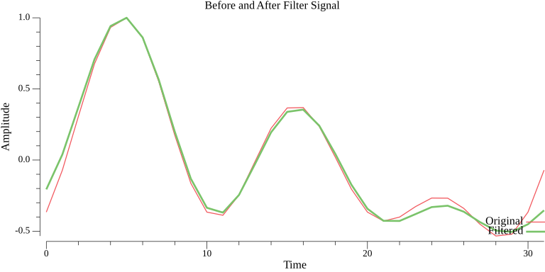
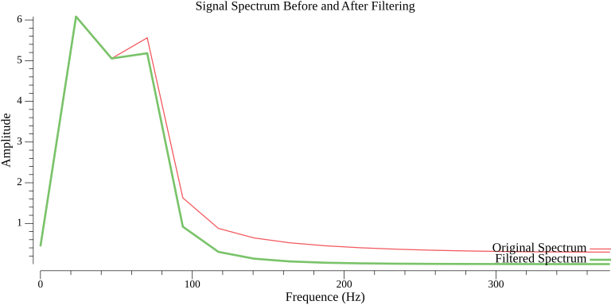
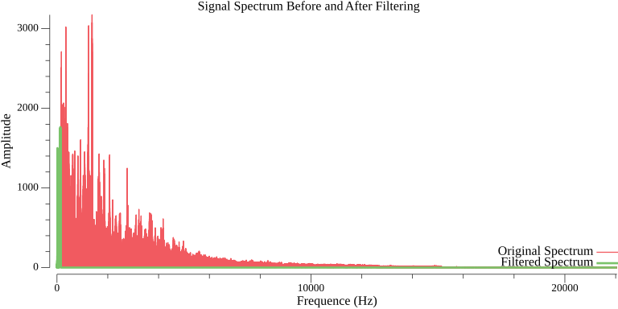
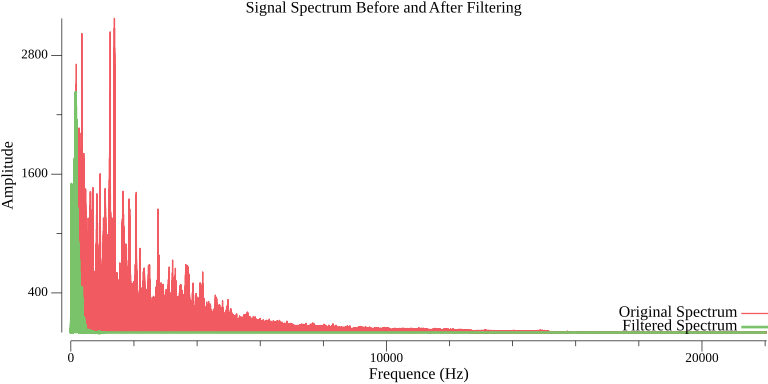

# LowPassFilter in golang example :

N is the length of the input time-domain signal

sampleRate is the number of samples per second (in Hz) used to capture the signal and determines the range of frequencies we can analyze.

The duration T of the signal in the time domain: T = N / sampleRate

freqResolution  = Δf = sampleRate / N

Shannon-Nyquist Theorem  fmax = sampleRate/2

Sampling Period Δt = 1 / sampleRate

See Manuel de calcul numérique appliqué : Christian Guilpin (EDP Sciences)

go run main.go

# filter on sinusoïd 

and

# audio filter 

The low-pass filter is greatly improved if a continuous attenuation function is used.

*multiplying the  spectrum by a rectangular window function H(f) in the frequency domain.*

*multiplying the spectrum by a continous function in the frequency domain.*

*filtered signal with low pass filter at 150 Hz*

See Manuel de calcul numérique by Christian GUILPIN (edp sciences : 1999)
extrait :
chapter 12.1 : application à l'etude d'un filtre passe-bas (page 245)
(b) Il est préférable d'utiliser un filtre constitué d'une fonction continue afin de réduire les oscillations données par l'approximation.

(eng)
Chapter 12.1: Application to the Study of a Low-Pass Filter (page 245)
(b) It is preferable to use a filter based on a continuous function in order to reduce the oscillations caused by the approximation.